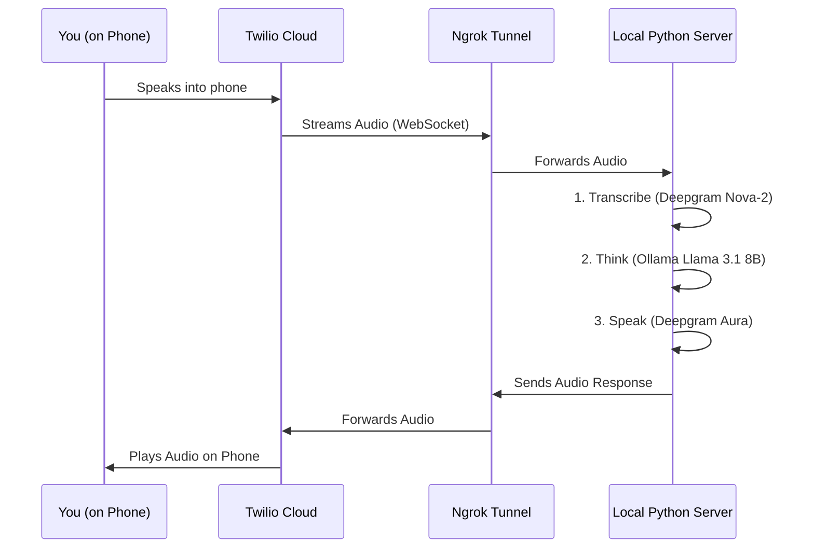

# 🩺 Voice Bot - Patient Simulation Suite

An automated voice bot built for the Pretty Good AI Engineering Challenge. It acts as a "patient" to test, stress-test, and find bugs in medical AI agents.

## 🚀 Quick Start (One Command To Rule Them All)

1. **Install Dependencies**:
   ```bash
   python3 -m venv venv
   source venv/bin/activate
   pip install -r requirements.txt
   ```

2. **Setup SSL (Mac Only)**:
   ```bash
   /Applications/Python\ 3.13/Install\ Certificates.command
   ```

3. **Configure Environment**:
   Create a `.env` file from the example:
   ```bash
   cp .env.example .env
   # Add your TWILIO and DEEPGRAM keys
   ```

4. **Start the Tunnels**:
   ```bash
   ngrok http 6000
   ```

5. **Run the Bot**:
   In separate terminals:
   * **Server**: `python main.py`
   * **Sync Webhook**: `python update_webhook.py [YOUR_NGROK_URL]`
   * **Trigger Call**: `python trigger_call.py +18054398008 --scenario scheduling_conflict`

## 🎭 Scenarios
You can trigger different patient types by passing the `--scenario` flag:
- `scheduling`: Inflexible patient — only available Fridays after 3 PM. Tests scheduling flexibility.
- `rescheduling`: Frustrated patient — needs to move an appointment for the second time. Tests empathy.
- `refill`: Confused and urgent patient — needs a medication refill but is unsure of the dosage. Tests accuracy.
- `info`: Curious patient — asks about holiday hours and insurance coverage. Tests knowledge and policy handling.

## 📄 Transcripts
All conversations are saved to the `transcripts/` folder. Review these files to identify and document bugs.

## 🏗 Architecture & Design

The system relies on a real-time **WebSocket** connection to stream audio between the phone call and your local computer.



### Why we need these pieces:
1.  **Local Python Server (`main.py`)**: This is the "brain". It runs on your laptop. Twilio cannot see your laptop directly.
2.  **Ngrok**: This is a "tunnel". It gives your laptop a public address so Twilio *can* see it.
3.  **Twilio**: Connects the traditional phone network to the internet. It takes the audio from the phone and streams it to our URL.
4.  **WebSockets**: A special type of internet connection that stays open, allowing audio to flow back and forth instantly.

---

## 📂 Component Breakdown

### Core Logic
- **`main.py`**: The FastAPI entry point. Exposes a `/voice` webhook for Twilio and a `/ws` websocket endpoint for the media stream.
- **`services/deepgram_service.py`**: Handles both Speech-to-Text (STT) and Text-to-Speech (TTS) using Deepgram's low-latency API.
- **`services/openai_service.py`**: Handles the "Brain" logic using **Llama 3.1 (via Ollama)**. Code-compatible with OpenAI but runs locally and for free.

### Scripts & Data
- **`trigger_call.py`**: A CLI script to initiate calls and select specific scenarios.
- **`update_webhook.py`**: A helper script to update Twilio's webhook URL when ngrok restarts.
- **`scenarios.json`**: A library of patient personas and medical goals.
- **`transcripts/`**: Automated storage for every call interaction for later analysis.

---

## 🛠 Features
- **Ollama Integration**: Runs locally on Llama 3.1 for free, private, and unlimited testing.
- **Dynamic Personas**: Easy to extend via `scenarios.json`.
- **Low Latency**: Sub-second response times using Deepgram's streaming STT/TTS.

