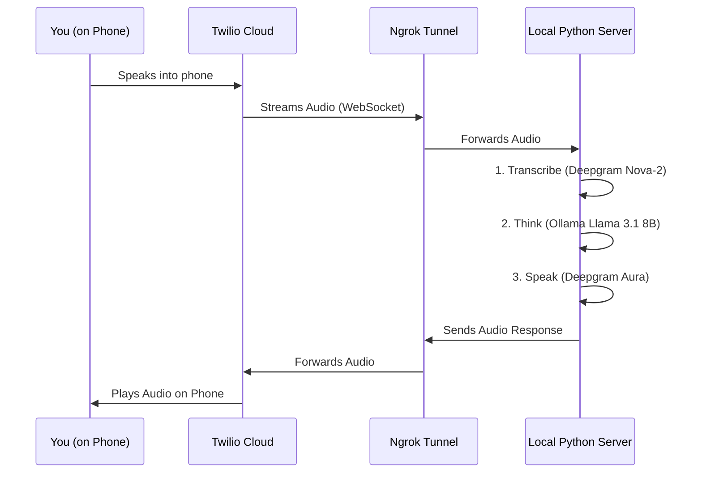

# 🩺 Voice Bot - Patient Simulation Suite

An automated voice bot built for the Pretty Good AI Engineering Challenge. It acts as a "patient" to test, stress-test, and find bugs in medical AI agents.

## 🚀 Quick Start (One Command To Rule Them All)

1. **Install Dependencies**:
   ```bash
   python3 -m venv venv
   source venv/bin/activate
   pip install -r requirements.txt
   ```

2. **Setup SSL (Mac Only)**:
   ```bash
   /Applications/Python\ 3.13/Install\ Certificates.command
   ```

3. **Configure Environment**:
   Create a `.env` file from the example:
   ```bash
   cp .env.example .env
   # Add your TWILIO and DEEPGRAM keys
   ```

4. **Start the Tunnels**:
   ```bash
   ngrok http 6000
   ```

5. **Run the Bot**:
   In separate terminals:
   * **Server**: `python main.py`
   * **Sync Webhook**: `python update_webhook.py [YOUR_NGROK_URL]`
   * **Trigger Call**: `python trigger_call.py +18054398008 --scenario scheduling_conflict`

## 🎭 Scenarios
You can trigger different patient types by passing the `--scenario` flag:
- `scheduling`: Inflexible patient — only available Fridays after 3 PM. Tests scheduling flexibility.
- `rescheduling`: Frustrated patient — needs to move an appointment for the second time. Tests empathy.
- `refill`: Confused and urgent patient — needs a medication refill but is unsure of the dosage. Tests accuracy.
- `info`: Curious patient — asks about holiday hours and insurance coverage. Tests knowledge and policy handling.

## 📄 Transcripts
All conversations are saved to the `transcripts/` folder. Review these files to identify and document bugs.

## 🏗 Architecture & Design

The system relies on a real-time **WebSocket** connection to stream audio between the phone call and your local computer.



### Why we need these pieces:
1.  **Local Python Server (`main.py`)**: This is the "brain". It runs on your laptop. Twilio cannot see your laptop directly.
2.  **Ngrok**: This is a "tunnel". It gives your laptop a public address so Twilio *can* see it.
3.  **Twilio**: Connects the traditional phone network to the internet. It takes the audio from the phone and streams it to our URL.
4.  **WebSockets**: A special type of internet connection that stays open, allowing audio to flow back and forth instantly.

---

## 📂 Component Breakdown

### Core Logic
- **`main.py`**: The FastAPI entry point. Exposes a `/voice` webhook for Twilio and a `/ws` websocket endpoint for the media stream.
- **`services/deepgram_service.py`**: Handles both Speech-to-Text (STT) and Text-to-Speech (TTS) using Deepgram's low-latency API.
- **`services/openai_service.py`**: Handles the "Brain" logic using **Llama 3.1 (via Ollama)**. Code-compatible with OpenAI but runs locally and for free.

### Scripts & Data
- **`trigger_call.py`**: A CLI script to initiate calls and select specific scenarios.
- **`update_webhook.py`**: A helper script to update Twilio's webhook URL when ngrok restarts.
- **`scenarios.json`**: A library of patient personas and medical goals.
- **`transcripts/`**: Automated storage for every call interaction for later analysis.

---

## 🛠 Features
- **Ollama Integration**: Runs locally on Llama 3.1 for free, private, and unlimited testing.
- **Dynamic Personas**: Easy to extend via `scenarios.json`.
- **Low Latency**: Sub-second response times using Deepgram's streaming STT/TTS.

---

## 🎬 Video Walkthrough Guide (5-7 Minutes)

This guide is designed to help you hit the 5-7 minute requirement by going deeper into the "Why" and "How".

### 1. The Vision & Approach *(~1 Minute)*
*   **The Problem**: Testing voice-based medical AI is a "latency and logic" nightmare. Human testers are slow, and simple automated scripts can't simulate a distracted or frustrated patient.
*   **The Approach**: We built a "Reverse AI Agent". Instead of an AI that answers questions, we built an AI that **asks** them, pushes back on schedule slots, and simulates human conversational quirks (like mid-sentence pauses).
*   **Aesthetic Choice**: We prioritized local execution (Ollama) to ensure the developer can run 100 tests for $0, while keeping the stack production-grade (FastAPI + WebSockets + Deepgram).

### 2. Deep Dive: How it Works *(~2 Minutes)*
*   **The Handshake**: Explain how `trigger_call.py` initiates a PSTN call, and how `update_webhook.py` keeps the Ngrok tunnel in sync.
*   **Live Stream**: Mention that we aren't sending files back and forth; we are streaming raw audio bytes through a WebSocket. This is the only way to achieve sub-second latency.
*   **The Stack**: 
    *   **Deepgram Nova-2**: Selected for its "endpointing" capability (knowing when a human has actually finished speaking).
    *   **Llama 3.1 8B**: Small enough to run locally on a Mac but smart enough to follow complex persona rules.
    *   **Deepgram Aura**: Selected for its conversational speed and MuLaw compatibility.

### 3. The "Brain" Strategy: Phase-Based Prompting *(~1 Minute)*
Show the `services/openai_service.py` system prompt. This is the most important part of the code.
*   **Goal Locking**: The AI is "locked" in an Identity phase until the receptionist triggers the Goal phase.
*   **Breathing Room**: We use turn-taking heuristics (responding with "Mmhmm") to prevent the AI from talking over the agent if they pause to type.

### 4. How AI Tools Were Used *(~1-2 Minutes)*
Explain how you leveraged state-of-the-art AI to build this in record time:
*   **In-App AI**: Deepgram for STT/TTS and Ollama for the LLM core.
*   **Development AI (Antigravity)**: 
    *   Used AI to rapidly prototype the TwiML WebSocket handshake, which is notoriously tricky to debug.
    *   Leveraged AI for **"Stress Test Generation"**: Using LLMs to brainstorm the "edge case" scenarios (like the insurance confusion or medication dosage dilemma) found in `scenarios.json`.
    *   AI-assisted debugging of SSL certificate issues and Ngrok tunnel stability.

### 5. Findings & Results *(~1 Minute)*
*   **Bugs Discovered**: Reference the `transcripts/` folder. Show an example where the target agent hallucinated a time slot or failed to handle the "Friday after 3 PM" constraint.
*   **Conclusion**: Summarize that this tool doesn't just "test" the agent; it **audits** the agent's logic under pressure.
